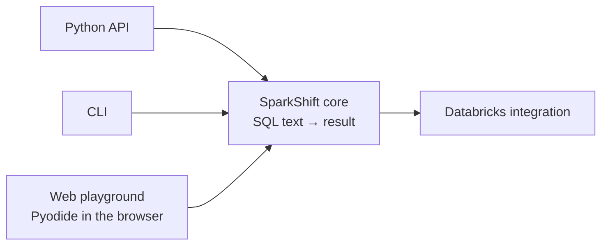
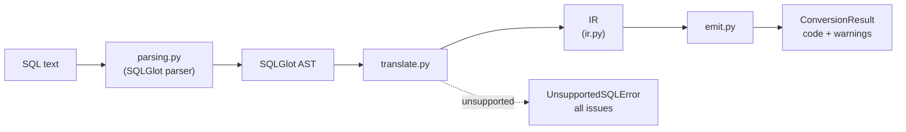

# Architecture

> **Status:** the pipeline below exists end to end for the smallest query
> (`SELECT * FROM table`). Interfaces other than the Python API are planned.
> This document records the boundaries that keep them possible.

## The core idea

SparkShift's core is a **pure translation function**: SQL text goes in, a
structured result comes out. Everything else — the command line, the browser
playground, Databricks — is a thin interface around that function.

## Translation pipeline

| Stage | Module | Responsibility |
|---|---|---|
| Frontend | `parsing.py` | SQL text → SQLGlot syntax tree; converts SQLGlot errors into SparkShift errors ([ADR 0001](adr/0001-use-sqlglot-for-parsing.md)) |
| Frontend | `translate.py` | Syntax tree → IR. Works from an allowlist: anything it does not explicitly handle is reported as unsupported, and all issues are collected before failing |
| Middle | `ir.py` | SparkShift's own description of DataFrame operations ([ADR 0003](adr/0003-introduce-a-small-ir.md)) |
| Backend | `emit.py` | IR → readable PySpark source |
| Entry point | `api.py` | `convert(sql, dialect)` runs the stages in order |

Only `parsing.py` and `translate.py` may import SQLGlot; the IR and emitter
never depend on it. Both rules are enforced by `tests/test_architecture.py`.

### Errors and warnings

Errors are exceptions; warnings are data. Every exception derives from
`SparkShiftError`. A query that cannot be translated safely raises
`UnsupportedSQLError`, whose `issues` list every unsupported construct. A
successful conversion returns a `ConversionResult` whose `warnings` describe
anything the user should review.

### Generated-code contract

Generated code assigns the final DataFrame to a variable named `result` and
expects a SparkSession named `spark` to exist, as in a Databricks notebook.

## Rules for the core

These rules keep every planned interface possible:

1. **No I/O.** The core does not read files, print, read environment variables,
   or use the network. Input is a string; output is data. Interfaces own I/O.
2. **No Spark.** The core generates PySpark code but never imports PySpark
   ([ADR 0002](adr/0002-pyspark-is-not-a-runtime-dependency.md)).
   Enforced by `tests/test_architecture.py`.
3. **Pure-Python dependencies only.** Anything the core depends on must run in
   Pyodide (Python compiled to WebAssembly), so the playground can run without
   a server.
4. **Structured results, not just strings.** A conversion returns the generated
   code together with warnings and unsupported constructs, so every interface
   can present them in its own way.
5. **Deterministic output.** The same input always produces exactly the same
   code. This makes golden-output tests possible and diffs meaningful.

## How each interface will use the core

| Interface | Responsibility | Core rule it relies on |
|---|---|---|
| **Python API** | Call the conversion function directly from Python code. | Structured results |
| **CLI** | Read SQL from a file or stdin, print code to stdout, warnings to stderr, and return meaningful exit codes. | No I/O in core |
| **Web playground** | Load the SparkShift and SQLGlot wheels into Pyodide in the browser and call the core from JavaScript. No backend server. | Pure Python, no Spark |
| **Databricks** | Wrap generated code in notebook format; optionally deploy it through the Databricks SDK as an optional extra (`sparkshift[databricks]`), with credentials from the environment. | No Spark, no I/O in core |

## How correctness is verified

The browser playground never runs Spark. Correctness is verified separately, in
CI: for each supported query, the test suite executes both the original SQL
(`spark.sql(...)`) and the generated PySpark against the same data on real
Apache Spark, and compares the results with SQL semantics in mind (row order,
NULLs, duplicates, types).
