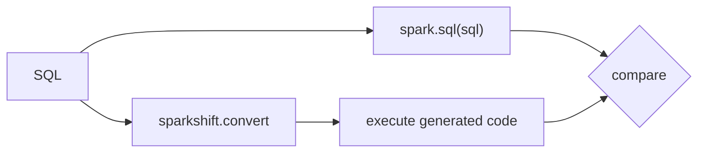

# Testing and correctness

SparkShift's central claim is that generated code returns the same result as
the original SQL. That claim is checked by executing both on real Apache Spark.

## Test layers

| Layer | Location | What it checks | Needs Spark |
|---|---|---|---|
| Unit | `tests/test_*.py` | Parsing, translation decisions, error messages | No |
| Golden output | `tests/test_emit.py`, `tests/test_api.py` | The exact generated code, so readability changes are deliberate | No |
| Formatting | `tests/equivalence/test_formatting.py` | Every scenario's generated code, and that of sample queries written the way people paste them, fits 88 columns, and wrapping at any width leaves the Python syntax tree unchanged | No |
| Browser | `tests/playground/` | The playground, in headless Chromium, converts every example exactly as the command line does | No (needs Chromium and network) |
| Architecture | `tests/test_architecture.py` | Dependency rules: no PySpark in the core, SQLGlot only in the frontend | No |
| Equivalence | `tests/equivalence/` | Original SQL and generated PySpark return equivalent results | Yes |
| Real databases | `tests/equivalence/test_postgres.py` | PostgreSQL queries, run on a real PostgreSQL server, return what the generated PySpark returns | Yes (and a PostgreSQL server) |

Run everything with `uv run pytest`, or skip Spark with `uv run pytest -m "not spark"`.
Database tests skip unless a server is configured (see below).

## Equivalence testing

For each scenario, `assert_equivalent(spark, sql)`:

1. Runs `spark.sql(sql)` to produce the reference result.
2. Converts the SQL with SparkShift and executes the generated code, which must
   assign a DataFrame to `result`.
3. Compares the two results using the rules below.

The SQL must also be valid Spark SQL, because it is executed directly as the
reference.

## Comparison rules

Comparing `collect()` output with `==` would be wrong for SQL. The comparator
in `tests/equivalence/compare.py` applies these rules:

| # | Rule | Why |
|---|---|---|
| 1 | **Row order is ignored, unless the query has `ORDER BY`** | Without `ORDER BY`, SQL guarantees no row order. Two correct plans may return rows in different orders. |
| 2 | **Rows are compared as a multiset** | Duplicate rows must match in number. Comparing as a set would hide a bug that removes duplicates. |
| 3 | **Column names, order, and types must match** | `SELECT *` must produce the same columns in the same order; `int` vs `bigint` or a different decimal scale is a real difference to consumers. |
| 4 | **Nullability flags are ignored** | Spark derives "may contain NULL" metadata differently depending on the code path. Actual NULL values are still compared. |
| 5 | **NULL matches NULL** | In SQL, `NULL = NULL` is not true, but when comparing results, NULL in both means they agree. |
| 6 | **Floats match within a tolerance; everything else exactly** | Floating-point addition is not associative, so a different evaluation order can change the last digits. Decimals, strings, dates, and timestamps must match exactly. |
| 7 | **`LIMIT` without `ORDER BY`: count plus sub-multiset** | Such a query may return *any* `n` rows, so two correct runs can return different rows. The harness removes the `LIMIT` to build the unlimited reference, then checks that the row count matches and that every returned row exists in the unlimited result, duplicates included. |
| 8 | **`ORDER BY`: tie groups in sequence** | Rows that are equal on the sort keys may come in any order, so comparing lists with `==` would be flaky. Consecutive rows with equal keys form a group; the groups must appear in the same sequence, and each is compared as a multiset. With a `LIMIT`, only the last group may be cut short, and its rows must come from the same group of the unlimited result. |

### Ordered scenarios

A scenario for a query with `ORDER BY` names its `order_keys`: the output
columns whose values decide the order. The harness requires them exactly when
the query has `ORDER BY`, so no ordered query is checked as if order did not
matter. When a query sorts by a column it does not output, the test data has
no ties on that column, and every output column is a key.

### Dialect scenarios

The reference result comes from running the SQL with `spark.sql`, so it must be
valid Spark SQL. For dialect syntax Spark cannot run, such as T-SQL `TOP` or
Oracle `FETCH FIRST`, a scenario supplies a hand-written Spark SQL reference
(`reference_sql`) that expresses the same query.

A hand-written reference is only as right as its author's reading of the
dialect. Where a real database is available, the scenarios also run there.

### Real databases

| Dialect | Checked on the real database | How |
|---|---|---|
| PostgreSQL | Yes: every PostgreSQL dialect scenario and example | A PostgreSQL 18 container in CI |
| T-SQL, MySQL, Oracle | Not yet (MySQL is planned) | Spark SQL references only |
| Snowflake, BigQuery | No: cloud services that need an account | Spark SQL references only |

`tests/equivalence/test_postgres.py` loads the test tables into PostgreSQL
(`tests/equivalence/databases.py` maps each Spark type to a PostgreSQL type),
runs each query there exactly as written, and compares the rows with the
generated PySpark's on Spark, using the rules above with three changes, since
the two engines name and type results their own way:

- Column names are compared ignoring case (PostgreSQL folds unquoted names to
  lower case), and column types are not compared; values are.
- In a column where either side has a float, numbers are compared as floats;
  otherwise, where either side has a decimal, as decimals.
- A timestamp with a time zone is compared as the UTC wall-clock time, as Spark
  returns it in a UTC session. A date never matches a timestamp, even at
  midnight.

Preparing these tests caught a wrong reference: PostgreSQL's documentation
says `date + INTERVAL` returns a timestamp, where Spark and the other dialects
keep a date, and a scenario assumed a date. SparkShift now converts it only
when the value's type is visible in the query, and the scenario checks both
forms on PostgreSQL itself.

To run these tests, point `SPARKSHIFT_POSTGRES_URL` at a database they may
write to (they create and drop the schema `sparkshift_tests`), for example
`postgresql://postgres@localhost:5432/postgres`, and run
`uv run pytest -m database`. Without it they skip, except where
`SPARKSHIFT_DATABASE_REQUIRED` is set, as in CI, where they fail instead, so a
green CI job always means they ran.

### Testing the comparator

A comparator that always reports "equal" would make every equivalence test
pass and prove nothing. `tests/equivalence/test_compare.py` therefore includes
cases that must fail: a missing duplicate, NULL vs empty string, NULL vs zero,
`int` vs `bigint`, reordered columns, unequal decimals, floats outside the
tolerance, and — for `LIMIT` — a wrong row count, a row not in the unlimited
result, and a duplicate returned more often than it exists. For `ORDER BY`,
it must catch reversed order, NULLs at the wrong end, a row moved across a
group boundary, and a cut group padded with a row from elsewhere.

## Test data

`tests/equivalence/datasets.py` defines the `customers` and `orders` tables
with explicit schemas. Rows are chosen to exercise SQL semantics: exact
duplicate rows, NULLs in every nullable column, empty strings, zero and
negative amounts, non-ASCII text, a leap-day timestamp with microseconds,
orders with no or unknown customers, and a customer with no orders.

`tests/equivalence/test_datasets.py` fails if any of these edge cases is
removed, because weakening the data silently weakens every test that uses it.
